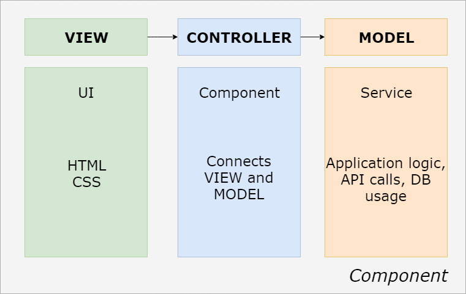

[Angular](https://angular.io/) is an open-source web framework developed by Google. It has all you need to create a rich cross-platform web (web, mobile, mobile native, desktop native) application.

The framework supports OOP principals and is component based.

The components are built using MVC pattern. Angular uses typescript.

Here is a picture to show the Angular component:

* View is a UI component which consists of HTML and CSS files
* Controller is a mediator component which connects View to the Model
* Model is a service component which implements a business logic of web application, it usually contains the web API calls, database connections etc.

You can make modules from components as components are reusable. The modules will make code easy to understand, maintain, and fit for unit testing

Examples of sites built with Angular:

* [Forbes](https://www.forbes.com)
* [Microsoft Customers](https://customers.microsoft.com/en-us)
* [Google Express](https://express.google.com/)
* [Microsoft Office Home](https://www.office.com/apps?auth=2)
* [Delta](https://www.delta.com/)
* and much more...
