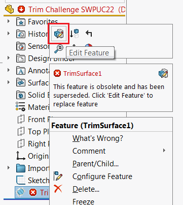
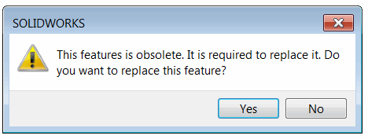

### Parameters

Macro feature parameters might need to change from version to version. And SwEx.MacroFeature framework provides a mechanism to handle the backward compatibility of existing features.

Mark current version of parameters with [ParametersVersionAttribute](https://docs.codestack.net/swex/macro-feature/html/T_CodeStack_SwEx_MacroFeature_Attributes_ParametersVersionAttribute.htm) and increase the version if any of the parameters changed.

Implement the [Paramater Version Converter](https://docs.codestack.net/swex/macro-feature/html/T_CodeStack_SwEx_MacroFeature_Base_IParametersVersionConverter.htm) to convert from the latest version of the parameters to the newest one. Framework will take care of aligning versions in case parameters are older than one version.

Old version of parameters
~~~ cs
[ParametersVersion("1.0", typeof(MacroFeatureParamsVersionConverter))]
public class MacroFeatureParams
{
    public string Param1 { get; set; }
    public int Param2 { get; set; }
}
~~~

New version of parameters

~~~ cs
[ParametersVersion("2.0", typeof(MacroFeatureParamsVersionConverter))]
public class MacroFeatureParams
{
    public string Param1A { get; set; }//parameter renamed
    public int Param2 { get; set; }
    public string Param3 { get; set; }//new parameter added
}

public class MacroFeatureParamsVersionConverter : ParametersVersionConverter
{
    private class VersConv_1_0To2_0 : ParameterConverter
    {
        public override Dictionary<string, string> ConvertParameters(IModelDoc2 model, IFeature feat, Dictionary<string, string> parameters)
        {
            var paramVal = parameters["Param1"];
            parameters.Remove("Param1");
            parameters.Add("Param1A", paramVal);//renaming parameter
            parameters.Add("Param3", "Default");//adding new parameter with default value
            return parameters;
        }
    }

    public ParamsMacroFeatureParamsVersionConverter()
    {
        //conversion from version 1.0 to 2.0
        Add(new Version("2.0"), new VersConv_1_0To2_0());
        //TODO: add more version converters
    }
}
~~~

If new dimensions have been added to the feature it is required to use the [DisplayDimensionPlacholder](https://docs.codestack.net/swex/macro-feature/html/T_CodeStack_SwEx_MacroFeature_Placeholders_DisplayDimensionPlaceholder.htm) within the [ConvertDispayDimensions](https://docs.codestack.net/swex/macro-feature/html/M_CodeStack_SwEx_MacroFeature_Base_IParameterConverter_ConvertDisplayDimensions.htm) method.

In some cases framework is not able to convert some parameters. For example Icons and Dimensions cannot be converted. In this case [SetParameters](https://docs.codestack.net/swex/macro-feature/html/M_CodeStack_SwEx_MacroFeature_MacroFeatureEx_1_SetParameters_1.htm) method will return the [outdate state](https://docs.codestack.net/swex/macro-feature/html/T_CodeStack_SwEx_MacroFeature_Base_MacroFeatureOutdateState_e.htm). If state is not up-to-date it is recommended to warn the user and call the [IFeatureManager::ReplaceComFeature](https://docs.codestack.net/swex/macro-feature/html/M_SolidWorks_Interop_sldworks_FeatureManagerEx_ReplaceComFeature__1.htm) extension method which will replace feature in the tree preserving all the parameters.

### Obsolete Feature

In some cases feature might become obsolete (i.e. no longer supported). Framework provides a mechanism to mark the feature as obsolete and allow replacement (if applicable).

* To mark the feature as obsolete copy the class name, namespace, guid and prog id of the obsolete feature.
* Mark the feature as COM visible
* Inherit the class from [ObsoleteMacroFeatureEx](https://docs.codestack.net/swex/macro-feature/html/T_CodeStack_SwEx_MacroFeature_Core_ObsoleteMacroFeatureEx.htm). If there s a replacement for this feature with the same model use this version of [ObsoleteMacroFeatureEx](https://docs.codestack.net/swex/macro-feature/html/T_CodeStack_SwEx_MacroFeature_Core_ObsoleteMacroFeatureEx_1.htm) and pass the model as a generic argument.

~~~ cs
namespace CodeStack.SwEx.MacroFeature.Features
{
    [ComVisible(true), ProgId(PROG_ID), Guid("08a4ab5f-7b8a-44b5-a487-b44026a02c2b")]
    public class SomeOriginalFeature : ObsoleteMacroFeatureEx<MacroFeatureModel>
    {
        internal const string PROG_ID = "CodeStack.SomeOriginalFeature";
    }
}
~~~

When user rebuilds the feature it will be rebuilt with the following error:

{ width=550 }

When user clicks *Edit Feature*

{ width=250 }

The following message is displayed

{ width=250 }

If *Yes* is clicked the framework will automatically replace the obsolete feature with new one and copy all of the parameters (if applicable).