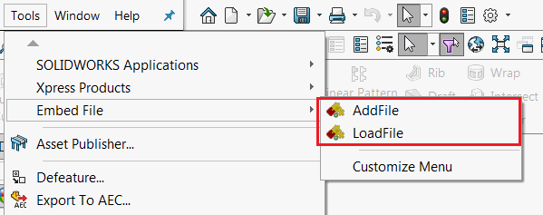

This example demonstrates how to use 3rd Party Storage in SOLIDWORKS API to embed and extract the file content directly into the model stream.

Example SOLIDWORKS add-in is built using the [SwEx.AddIn](/labs/solidworks/swex/add-in/) framework but it could work with any other methods of creating the add-ins.

Add-in adds two buttons in the menu and toolbar and provides two handlers correspondingly: 

{ width=400 }

* AddFile - asynchronous method to store the embed file data in the stream. This method asks user to select the file, reads its content and serializes it into a file stream.
* LoadFile - loads the embedded file from the stream and prompts user to select the file path to store the content. The file name is prepopulated based on the embedded file name

{ width=550 }

## Usage Instructions

* Open any model (model must be saved to a disk)
* Click "AddFile" button. File browse dialog is displayed. Select any file. File data is serialized into the model and message box is displayed.
* You can close the model and SOLIDWORKS
* Reopen the model and click "LoadFile". File data is deserialized from the model and File Save As dialog is displayed (name is populated based on the embedded file name). File is saved to the selected location

**EmbedFileAddIn.vb**



Structure used for serialization contains the content of the file and file name

**EmbedFileData.vb**



For simplicity [IStream](https://docs.microsoft.com/en-us/windows/desktop/api/objidl/nn-objidl-istream) com stream is wrapped into the [System.IO.Stream](https://docs.microsoft.com/en-us/dotnet/api/system.io.stream?view=netframework-4.7.2) type.

**ComStream.vb**



Serialization and deserialization routine utilizing the [XmlSerializer](https://docs.microsoft.com/en-us/dotnet/api/system.xml.serialization.xmlserializer?view=netframework-4.7.2) class, but any other serialization methods could be used.

**EmbedFile.vb**


