

### Installing the VSI Extension

Download the Microsoft Visual Studio Installer Projects Extension from [Visual Studio Marketplace](https://marketplace.visualstudio.com/items?itemName=VisualStudioClient.MicrosoftVisualStudio2017InstallerProjects). Find the version which matches your Visual Studio version.

> It is recommended to close current session of Visual Studio when installing this extension.

### Creating setup project

Add new Setup project to the solution which can be found under the *Other Project Types->Visual Studio Installer* section.

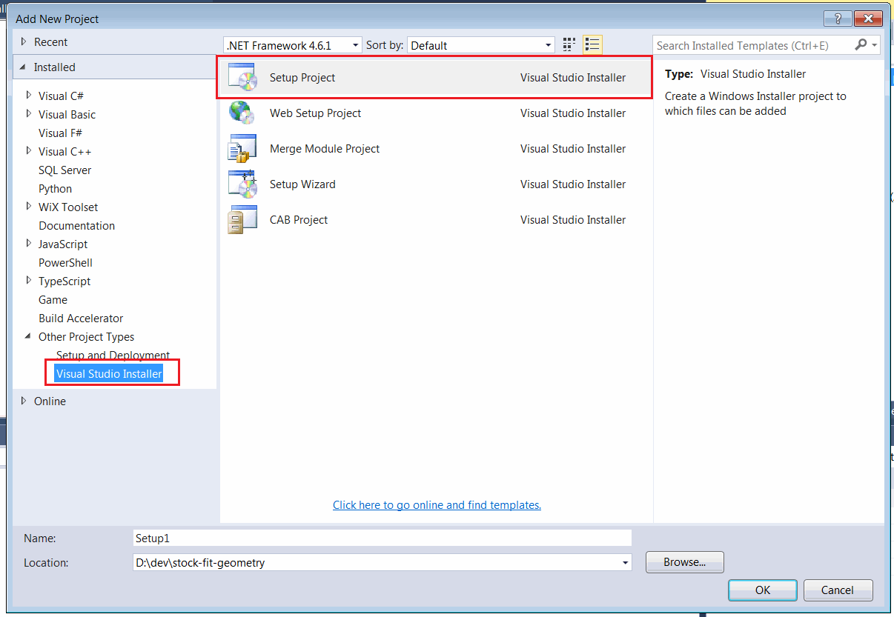{ width=450 }

Configure the attributes of the installer by selection Setup project in the solution tree and changing the attributes in the properties page.

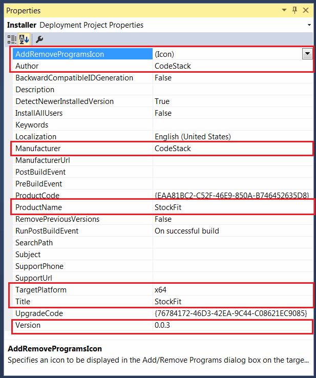{ width=350 }

> Make sure to select the correct version of the platform. Default option x86 should be changed to x64 to support 64-bit versions of SOLIDWORKS.

### Adding installation files and COM registration

Click right mouse button (RMB) o the project node and select *Add-->Project Output...* command from the context menu.

{ width=300 }

Select the main project of the add-in in the drop down and select *Primary Output* option

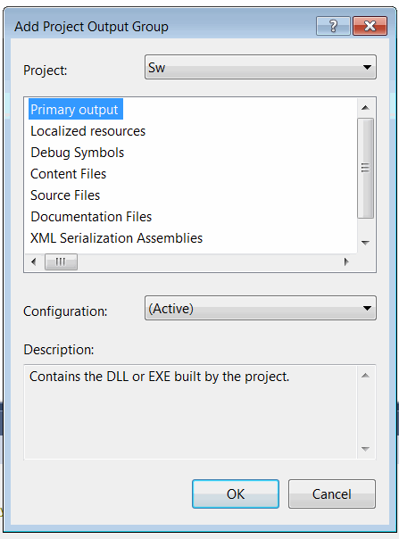{ width=250 }

This will allow to add the dll into the setup as well as all dependent dlls and files.

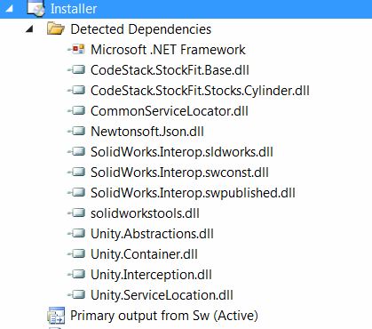{ width=250 }

This will also register the COM objects in the dll.

### Customizing installer view

Installer can be customized and new components can be added via installer views.

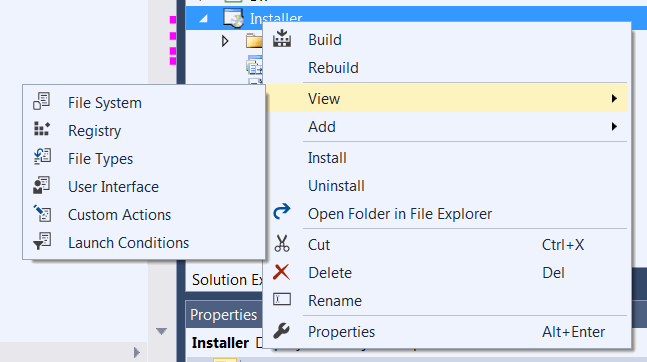{ width=300 }

### Adding registry entries

Registry values need to be added into the *SolidWorks* registry section to make SOLIDWORKS recognize the add-in.

Open the *Registry View*

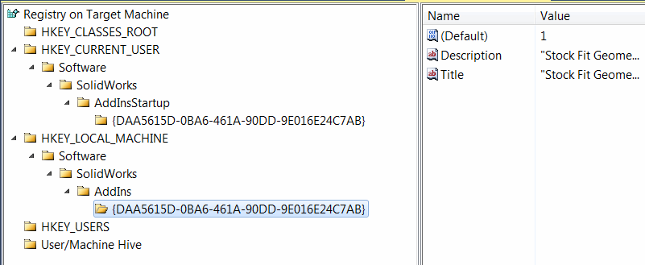{ width=350 }

Add the following:
> HKEY_LOCAL_MACHINE\Software\SolidWorks\Addins\[{ADDIN GUID}]

And add the following fields to this key:

(default) (DWORD Value) equals to 1. Simply leave the field name empty to set it to default (do not type (default) explicitly)

Title (String Value) - value is a title of the add-in

Description (String Value) - value is a description of the add-in

In order for the add-in to be loaded at startup add the following key

> HKEY_CURRENT_USER\Software\SolidWorks\AddinsStartup\[{ADDIN GUID}]

Add the default DWORD field with value 1

### Adding resource files

Add the resource files to the installer by RMB on the add-in project and selecting *Add->Files* menu command. The resource files can be used to add icon to the installer, banner images, EULA etc.

#### Customizing User Interface

Open the *User Interface* view. This view contains the list and order of all pages displayed during the installation process.

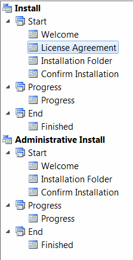{ width=150 }

Pages can be customized, added, deleted and reordered.

Select all pages and set the banner image. Banner image displayed at the top of the installer and is a bitmap (bmp) or png file of 500x70 pixels size.

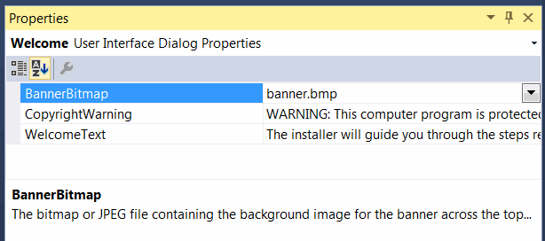{ width=300 }

Change the banner attribute by browsing the bitmap resource added in previous step.

{ width=300 }

More pages can be added to the installer, such as End User License Agreement (EULA) or registration page.

### Installing add-in

When project compiled the msi package is generated in the output directory. This package can be redistributed to the user for installing your product.

{ width=300 }

Once installed the product icon appears in the Programs and Features page of the Control Panel. The product can be repaired or uninstalled within this page.

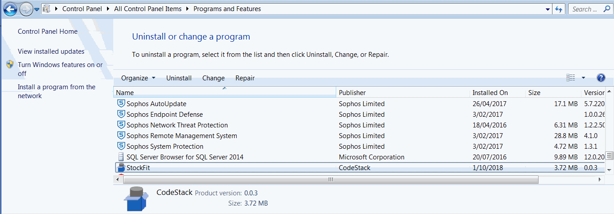{ width=650 }

### Releasing update

When product update is required and new installer needs to be redistributed it is required to update the version of the installer.

The following message may be displayed.

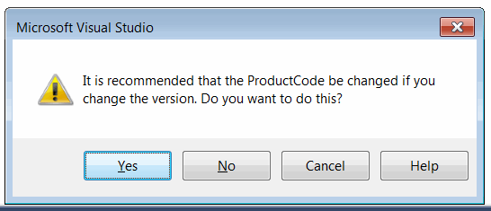{ width=300 }

It is required to change the *Product Code* for every new version while *Upgrade Code* should remain unchanged. This will allow users to upgrade without the need of uninstalling previous version of add-in (if already installed).

> It is required to change the assembly versions of all changed projects otherwise the installer would not update the dlls on the target machines.

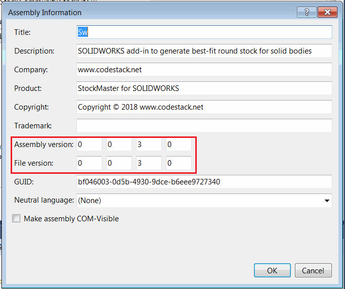{ width=300 }

