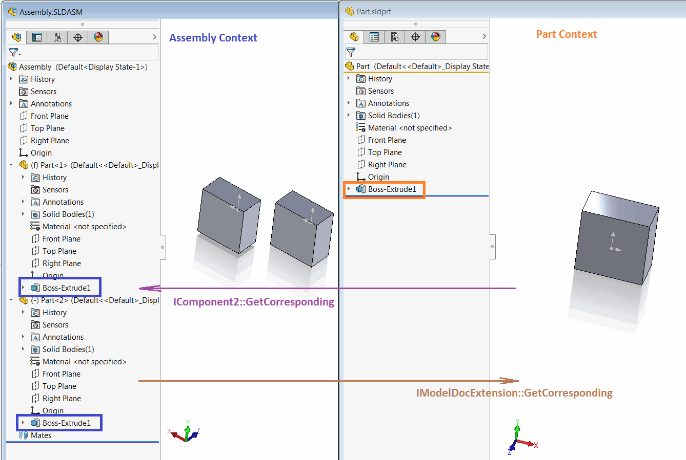
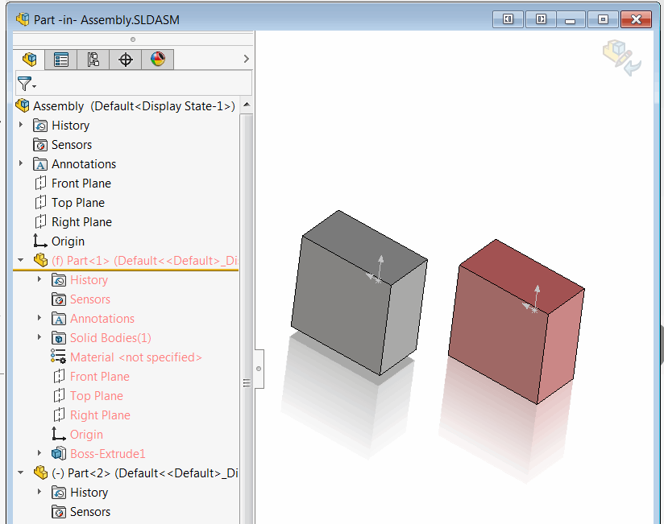
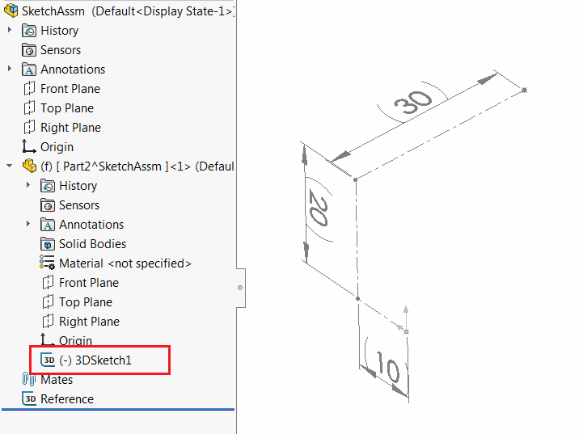
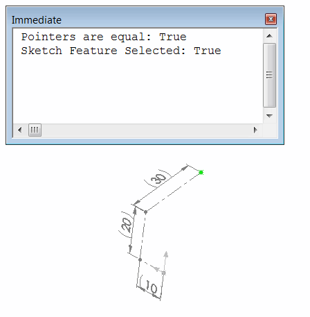
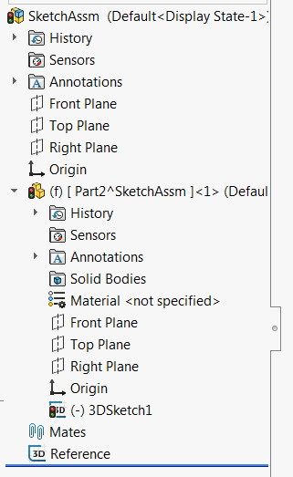

{ width=450 }

All SOLIDWORKS entities in 3D models (parts and assemblies) can be presented in 2 different contexts:

* Model context - this is the context the entity is created in. For example feature created in the part document, dimension added in the part. Solid body with the faces generated by boss-extrude feature
* Assembly context - this is the context where the models (and all their entities) are instantiated. For example the same part can be added twice into the assembly, so the elements of this part would have two different sets of pointers in the assembly which correspond to the corresponding components.

It is important to use the correct contexts when working with elements from SOLIDWORKS API. When assembly in-context editing is performed all the pointers must be provided in the assembly context.

## Adding features into part in the context of the assembly

It is required to always use the pointer to active assembly document ([ISldWorks::ActiveDoc](http://help.solidworks.com/2012/english/api/sldworksapi/solidworks.interop.sldworks~solidworks.interop.sldworks.isldworks~activedoc.html)) while editing or adding new features in the feature tree even if component is in editing state.

{ width=250 }

For example to insert the extruded feature into the part document from the image above which is edited in the context the [IFeatureManager::FeatureExtrusion2](http://help.solidworks.com/2012/english/api/sldworksapi/SolidWorks.Interop.sldworks~SolidWorks.Interop.sldworks.IFeatureManager~FeatureExtrusion2.html) must be called on the [IModelDoc2](http://help.solidworks.com/2012/english/api/sldworksapi/solidworks.interop.sldworks~solidworks.interop.sldworks.imodeldoc2_methods.html) which is an active assembly but not the model of the component being edited.



## Converting the pointers

SOLIDWORKS API provides the method to convert the pointers between contexts:

* [IModelDocExtension::GetCorresponding](http://help.solidworks.com/2012/english/api/sldworksapi/solidworks.interop.sldworks~solidworks.interop.sldworks.imodeldocextension~getcorresponding.html) converts the pointer from the assembly context into the underlying component's model context
* [IComponent2::GetCorresponding](http://help.solidworks.com/2012/english/api/sldworksapi/solidworks.interop.sldworks~solidworks.interop.sldworks.icomponent2~getcorresponding.html) converts the pointer from the underlying model context to the assembly context for this component.

## Model operations in the context of the assembly

{ width=350 }

The following test cases will demonstrate different approaches and results while working with context in assembly. [Download Sample Assembly](SketchAssm.SLDASM). This assembly consists of a single virtual component (this can be an external components as well). There is a 3D Sketch (*3DSketch1*) with a point in the component's model. For simplicity another sketch called *Reference* is added to the assembly which displays current point coordinate.

The purposes of the following cases is to move the point in the 3D Sketch in XYZ by 10 mm from the assembly.

### Test Case 1: Moving by acquiring the pointers directly from the assembly context

When assembly is opened pointer to any object retrieved directly from the assembly or from the component will have the active assembly context.

For example:

* [ISelectionMgr::GetSelectedObject6](http://help.solidworks.com/2012/english/api/sldworksapi/solidworks.interop.sldworks~solidworks.interop.sldworks.iselectionmgr~getselectedobject6.html) of the object selected in the component (e.g. face or feature) will be valid in the current assembly
* [IComponent2::FirstFeature](http://help.solidworks.com/2012/english/api/sldworksapi/solidworks.interop.sldworks~solidworks.interop.sldworks.icomponent2~firstfeature.html) returns the pointer for the first feature in the component's model in the context of the assembly.

These pointers are safe to work with within the context of this assembly. For example face colour can be changed, feature can be renamed, point coordinate can be modified.

* Open downloaded sample assembly
* Select the *3DSketch1* feature in the tree
* Run the following macro



As the result sketch point is moved by 10 mm in XYZ directions.

{ width=250 }

### Test Case 2: Accessing the objects from the underlying model context in the context of the assembly

It is not always possible to retrieve the pointer to the required object directly from the assembly context. If out of context object (i.e. object which was retrieved or converted to the underlying component's model) is used within the assembly context this may produce unexpected results.

> Using of out of context object equivalent of invoking the APIs on the invisible model. In some cases this will produce correct behaviour, in some cases it may fail or even cause the crash.

The following example demonstrates the result of using out of context pointers by converting the context from assembly to the underlying document via [IModelDocExtension::GetCorresponding](http://help.solidworks.com/2012/english/api/sldworksapi/solidworks.interop.sldworks~solidworks.interop.sldworks.imodeldocextension~getcorresponding.html)

Follow the steps from previous test case and run the following macro



As the result sketch points are not moved despite the output window displays the success

{ width=250 }

The reason of this behaviour caused by the fact that sketch cannot be edited if the model is not opened in its own window.

Now, open the component in its own window

{ width=250 }

Activate the assembly and rerun the macro. Now slightly different result is displayed. Component is marked as modified and needs rebuilding. If model rebuilt sketch is updated accordingly.

{ width=200 }

### Test Case 3: Converting the context of objects

In many cases the initial pointer is available in the context of the underlying model. And if modifications required in the context of assembly it is required to convert the pointer via [IComponent2::GetCorresponding](http://help.solidworks.com/2012/english/api/sldworksapi/solidworks.interop.sldworks~solidworks.interop.sldworks.icomponent2~getcorresponding.html) method.

* Close all models and reopen sample assembly
* Open the part component in its own window.

{ width=250 }

* Select the *3DSketch1* in the active part document
* Run the following macro



* Macro stops execution
* Activate the assembly (you can just close the part document)
* Select the component and continue the macro

Macro will convert the context and change the coordinate so the coordinates can be successfully updated in the context of the assembly

## Summary

* When adding or editing features of the components in the context of the assembly call [IAssemblyDoc::EditPart2](http://help.solidworks.com/2017/english/api/sldworksapi/solidworks.interop.sldworks~solidworks.interop.sldworks.iassemblydoc~editpart2.html)/[IAssemblyDoc::EditAssembly](http://help.solidworks.com/2017/english/api/sldworksapi/solidworks.interop.sldworks~solidworks.interop.sldworks.iassemblydoc~editassembly.html) to start/finish editing the component in the context

* It is not required to explicitly set the *Edit In Context* state to perform certain operations (for example editing the sketch points location, deleting features etc.). The behaviour matches the user interface behaviour (i.e. if it is required to call *Edit Part* command to perform certain operation it is required to call corresponding API as well)

* Do not use the pointer of the component's underlying model ([IComponent2::GetModelDoc2](http://help.solidworks.com/2017/english/api/sldworksapi/solidworks.interop.sldworks~solidworks.interop.sldworks.icomponent2~getmodeldoc2.html)) to perform the operation of the current editing target component. Use the pointer to top level document (i.e. active assembly)

* Avoid using the incorrect context. This may result in unexpected behaviour.

* Use ::GetCorresponding functions to convert the pointer between contexts when needed