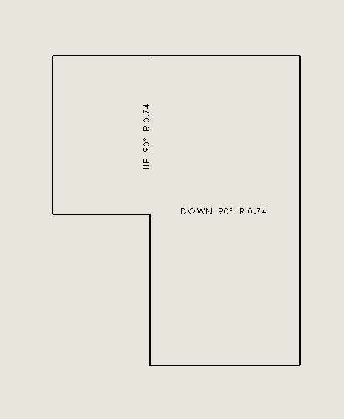

It is possible to find the mass of the specific body by using the [IBody2::GetMassProperties](http://help.solidworks.com/2016/english/api/sldworksapi/solidworks.interop.sldworks~solidworks.interop.sldworks.ibody2~getmassproperties.html) SOLIDWORKS API method, but it is required to specify the density in order to calculate mass which might not be easy to extract.

If it is required to find the mass of bodies in the drawing view, this method might not be applicable. The density is not available for the body if the material was applied to the body itself. It is possible to extract density form the material properties, but it will be required to [parse material XML file](http://localhost:4000/solidworks-api/document/materials/copy-custom-property/) to find the value of the node.

{ width=250 }

Alternative option is to use [IMassProperty](http://help.solidworks.com/2017/english/api/sldworksapi/SOLIDWORKS.Interop.sldworks~SOLIDWORKS.Interop.sldworks.IMassProperty.html) interface.

{ width=450 }

However pointers to bodies extracted at the drawing context are not applicable for the calculation. The mass value will always be equal to 0 in this case. The body pointers need to be converted to the part context in the corresponding configuration.

Below code of C# VSTA macro retrieves the mass of all bodies in the selected drawing view using SOLIDWORKS API and displays the result in the message box.

