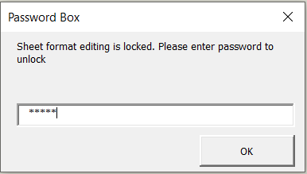

{ width=250 }

This VBA macro allows to disable (or password protect) the editing of the sheet format in SOLIDWORKS drawing using SOLIDWORKS API.

This macro can be useful where it is required to disallow users to modify the standard sheet format.

Macro provides 2 options which could be configured by changing the constants below:

~~~ vb
Public Const LOCK_WITH_PASSWORD As Boolean = False
Public Const PASSWORD As String = ""
~~~

## Locking the editing

Set the value of *LOCK_WITH_PASSWORD* to *False*. 

The following message is displayed every time the *Edit Sheet Format* command is called and command is cancelled:

## Password protecting the editing

Set the value of *LOCK_WITH_PASSWORD* to *True*. Set the value of *PASSWORD* to the target password.

It is recommended to password protect the VBA macro, so the password cannot be seen from the macro itself.

The following prompt is displayed every time the *Edit Sheet Format* command is called

If password matches, the sheet format can be edited, otherwise the command is cancelled and error message is displayed.

## Creating the macro

* Create new macro and paste [the code](#macro-module) of Macro Module
* Add new [class module](/visual-basic/classes/) and name it *SheetFormatEditorHandler*. Paste the [code below](#sheetformateditorhandler-class) into class module.
* Add new [user form](/visual-basic/user-forms/) and name it *PasswordBox*. Paste the [code below](#passwordbox-user-form) into the user form code
* Add the controls to the form as shown below and specify the name of each control as marked on the image

* Set the value of *PasswordChar* property of Text Box control to \* to hide the password from user interface while typing

The files tree should look similar to below image.

Follow the [Run Macro On SOLIDWORKS Start](/solidworks-api/getting-started/macros/run-macro-on-solidworks-start/) for the instruction of setting up the automatic run of the macro on SOLIDWORKS startup.

## Blocking other commands

This macro can be modified to block another commands. It could be also changed to handle multiple commands at the same time. In order to enable this it is required to modify the following line

~~~ vb
If Command = swCommands_Edit_Template Then
~~~

To the

~~~ vb
If Command = CmdId1 Or Command = CmdId2 ... Or Command = CmdId3 Then
~~~

For example the following line would block editing sketch, opening the SOLIDWORKS options dialog and printing the document. Refer the [Capture Commands](/solidworks-api/application/frame/capture-commands/) macro for an explanation of how to extract the IDs for the specific command in SOLIDWORKS.

~~~ vb
If Command = 859 Or Command = 342 Or Command = 589 Then
~~~

### Macro Module



### SheetFormatEditorHandler Class



### PasswordBox User Form


