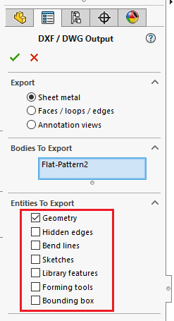

This VBA macro allows to export all flat patterns to DXF/DWG from all sheet metal components in the active SOLIDWORKS assembly or an active part document.

Macro enables flexibility in specifying the name of the output file allowing to use placeholders (original file name, feature name, custom property, cut-list custom property, etc.) combined with the free text and supports specifying sub-folders.

The following message box will be displayed once the exporting is completed.



## Configuration

Macro can be configured by modifying the **OUT_NAME_TEMPLATE** and **FLAT_PATTERN_OPTIONS** constants

### Output name template

This constant allows to specify template for the output path of the flat pattern.

This can be either absolute or relative path. If later, result will be saved relative to the assembly directory.

Extension (either .dxf or .dwg) must be specified as the part of naming template

The following placeholders are supported

* <\_FileName\_> - name of the part file (without extension) where the flat pattern resides in
* <\_FeatureName\_> - name of the flat pattern feature
* <\_ConfName\_> - name of the configuration of this flat pattern (i.e. referenced configuration of the component)
* <\_AssmFileName\_> - name of the main assembly
* <$CLPRP:[PropertyName]> - any name of the cut-list property to read value from, e.g. \<Thickness\> is replaced with the value of cut-list custom property *Thickness*
* <$PRP:[PropertyName]> - any name of the custom property of sheet metal part to read value from, e.g. \<PartNo\> is replaced with the value of cut-list custom property *PartNo*
* <$ASSMPRP:[PropertyName]> - any name of the custom property of main assembly to read value from, e.g. \<ProductId\> is replaced with the value of cut-list custom property *ProductId*

Placeholders will be resolved for each flat pattern at runtime.

For example the following value will save flat patterns with the name of the part document in the *DXFs* sub-folder in the same folder as main assembly

~~~ vb
Const OUT_NAME_TEMPLATE As String = "DXFs\<_FileName_>.dxf"
~~~

While the following name will save all of the flat patterns as DWG file into the *Output* folder in *D* drive, where the file name will be extracted from the *PartNo* property for each corresponding flat pattern.

~~~ vb
Const OUT_NAME_TEMPLATE As String = "D:\Output\<$CLPRP:PartNo>.dwg"
~~~

The following setup will create sub-folder corresponding to value of the **Thickness** custom property in cut-lists and name files using the **ProductName** custom property extracted from the main assembly followed by underscore symbol and value of **PartNo** property from sheet metal part document.

~~~ vb
Const OUT_NAME_TEMPLATE As String = "D:\Output\<$CLPRP:Thickness>\<$ASSMPRP:ProductName>_<$PRP:PartNo>.dwg"
~~~

### Flat pattern options

Options can be configured by specifying the values of **FLAT_PATTERN_OPTIONS**. Use **+** to combine options

For example to export hidden edges, library features and forming tools, use the setting below.

~~~ vb
Const FLAT_PATTERN_OPTIONS As Integer = SheetMetalOptions_e.IncludeHiddenEdges + SheetMetalOptions_e.ExportLibraryFeatures + SheetMetalOptions_e.ExportFormingTools
~~~

> Note, geometry option must always be specified as it is required for the flat pattern export

## Skip created files

**SKIP_EXISTING_FILES** options allows to specify if macro should regenerate output file if it already exists.

Set this option to true to skip exporting the file if the output file (.dxf or .dwg) exists on the target location.

~~~ vb
Const SKIP_EXISTING_FILES As Boolean = True
~~~

This option can be useful when processing large assemblies and it is required to continue the execution after SOLIDWORKS restart. Exporting flat patterns is a heavy performance operation so SOLIDWORKS may crash or hang when large job is processed. This option can help to continue the exporting after the restart.

## Troubleshooting

If macro reports an error, in some cases it might not be immediately evident what is causing an error as the error details are 'swallowed' by exception handler. In order to disable errors handling and reveal the exact line causing the error comment all *On Error GoTo catch_* lines in the code by placing the apostrophe ' symbol at the beginning of the line as shown below.

~~~ vb jagged
Sub main()
        
    Set swApp = Application.SldWorks
    
try_:
    'On Error GoTo catch_
~~~

~~~ vb jagged
Sub ExportFlatPattern(part As SldWorks.PartDoc, flatPattern As SldWorks.Feature, outFilePath As String, opts As SheetMetalOptions_e, conf As String)
    
    Dim swModel As SldWorks.ModelDoc2
    Set swModel = part
    
    Dim error As ErrObject
    Dim hide As Boolean

try_:
    
    'On Error GoTo catch_
~~~

Please submit the [bug report](https://github.com/xarial/codestack/issues/new?labels=bug) and attach snapshot of this error and model used to reproduce (if possible)

## Notes

* Macro will ask to resolve lightweight components if any. Macro can generate error if components are not resolved
* Each flat pattern from the multi-body sheet metal part will be exported. Make sure to use either <\_FeatureName\_> or <$CLPRP:[PropertyName]> to differentiate between result files
* $PRP and $ASSMPRP values will be firstly extracted from the configuration specific properties and if empty from the general file properties
* If specified property does not exist (for $CLPRP, $PRP and $ASSMPRP) - empty string is used as the placeholder value
* Macro will process all distinct components (file path + configuration)
* Macro will automatically create folders if required
* Macro will replace all path invalid symbols with \_
* Macro will only export unique bodies grouped under cut-list and skip flat patterns which belong to already exported cut-list


