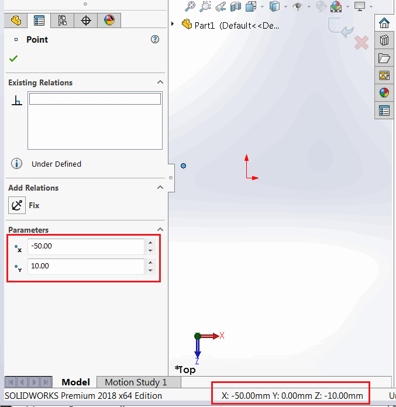

When working with sketch segments (e.g. line, arc, etc.) or points it is important to consider the fact that the coordinates values returned from SOLIDWORKS API such as [ISketchPoint::X](http://help.solidworks.com/2017/English/api/sldworksapi/SolidWorks.Interop.sldworks~SolidWorks.Interop.sldworks.ISketchPoint~X.html) property are relative to the local sketch coordinate system.

Those values will match for 3D Sketches or 2D sketches created on Front plane (if not moved), but will be different in other cases.

As shown on the following picture the value of the point is displayed as { -50, 10, 0 } for the local sketch coordinate system (in the sketch point property manager page) and as the { -50, 0, -10 } for the global coordinate system (in the SOLIDWORKS status bar). This difference is caused by the fact that 2D sketch is created on the Top Plane.

{ width=450 }

Local coordinate system of 2D sketch is displayed with red X and Y arrows when activating the sketch. And global coordinate system is represented with red, green and blue triad in the bottom right corner of SOLIDWORKS model window.

{ width=350 }

## Reading the local coordinates from sketch point

The following macro reads the selected sketch point coordinate relative to the local sketch coordinate system and outputs it to the immediate Window of SOLIDWORKS.

{ width=350 }

* Create a sketch on the Front Plane and create a sketch point
* Select this point
* Run the macro and compare with the global coordinate value (result is printed in meters)
* Values will match

{ width=350 }

* Create new sketch on any plane but Front Plane (e.g. Top Plane)
* Repeat the steps above
* Now coordinates do not match.



## Retrieving the global coordinates from sketch point

In order to find the value of the coordinate relative to the global coordinate system it is required to find the sketch to model [transformation matrix](/solidworks-api/geometry/transformation/) via [ISketch::ModelToSketchTransform](http://help.solidworks.com/2018/english/api/sldworksapi/SolidWorks.Interop.sldworks~SolidWorks.Interop.sldworks.ISketch~ModelToSketchTransform.html) SOLIDWORKS API property and apply this to the point coordinate.

Below macro can be used to perform the steps from the previous paragraph, but now the extracted coordinates will match the values in the global coordinate system.



## Creating point in sketch from global coordinates

Inversed transformation should be used when it is required to create a sketch point in the 2D sketch based on the global coordinate value. The following example inserts a sketch point into an active sketch based on a XYZ value.


