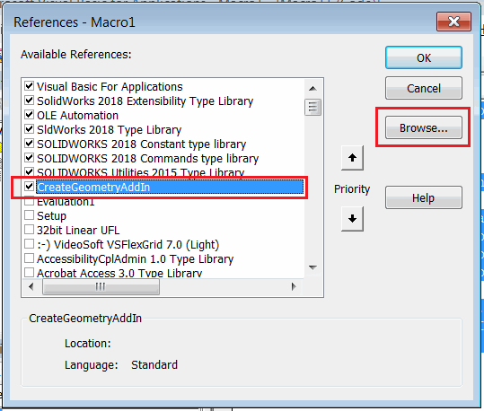
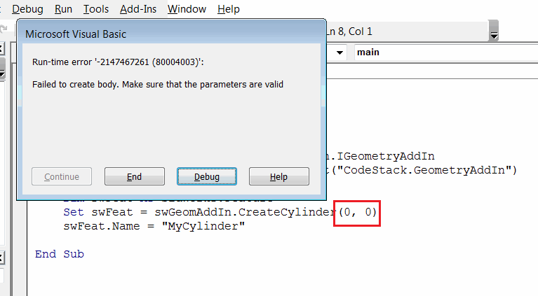

This article explains how to call function of SOLIDWORKS add-in from stand-alone application or macro by retrieving add-in object using SOLIDWORKS API.

This is based on the same technique to enable COM communication as shown in this video tutorial to reuse .NET functions from the VBA macros:



## Enabling API in the add-in

To enable API in your add-in it is required to follow several rules

* Add-in must implement COM visible interface which is exposing COM visible function.
* All of the parameters and return values of those functions must be COM visible as well
* Add-in must generate Type Library (TLB) with definitions of those API functions

When developing c# application it is required to create com-visible interface and implement it in the add-in.

~~~ cs
[ComVisible(true)]
public interface IMyAddInApi
{
    void FooApiMethod();
} 

[ComVisible(true), Guid("799A191E-A4CF-4622-9E77-EA1A9EF07621")]
public class MyAddIn : ISwAddIn
{
    ...
    public void FooApiMethod()
    {
        //Implement
    }
}
~~~

If *Register for COM Interop* option is selected in Visual Studio this will automatically add all com-visible functions, classes and interfaces to the tlb file.

{ width=550 }

## Example add-in with API

The following add-in examples is built using the [SwEx.AddIn Framework](/labs/solidworks/swex/add-in/), but the same technique can apply to add-in built with different methods.

Add-in adds the menu command under the *Tools* menu allowing to create cylindrical feature

{ width=350 }

When invoked from the menu, cylinder will have hard-coded parameter values.

{ width=350 }

At the same time add-in exposes the public API *CreateCylinder* which allows to create cylinder. API has two parameters:

* Diameter
* Height

And returns the pointer to [IFeature](http://help.solidworks.com/2018/english/api/sldworksapi/solidworks.interop.sldworks~solidworks.interop.sldworks.ifeature.html). Because SOLIDWORKS API is COM visible, add-in can directly use this interface in the communication.

*CreateCylinder* function itself is used by the add-in *Create Cylinder* command.

### C# Add-in source code



## Accessing the add-in

To access the add-in and its API it is required to retrieve the pointer to the add-in interface. [ISldWorks::GetAddInObject](http://help.solidworks.com/2018/english/api/sldworksapi/solidworks.interop.sldworks~solidworks.interop.sldworks.isldworks~getaddinobject.html) SOLIDWORKS API function can be used to get the pointer to the add-in by its program id (ProgID) or global unique identifier (GUID)

The below code snippet retrieves the pointer to the add-in from its guid. This is the value assigned via [Guid](https://docs.microsoft.com/en-us/dotnet/api/system.runtime.interopservices.guidattribute) attribute on the add-in class:

~~~ vb
Set swGeomAddIn = swApp.GetAddInObject("{799A191E-A4CF-4622-9E77-EA1A9EF07621}")
~~~

Alternatively add-in can be retrieved by its ProgId. If ProgId is not specified explicitly then it is equal to *Namespace*.*ClassName*

~~~ vb
Set swGeomAddIn = swApp.GetAddInObject("CodeStack.Examples.CreateGeometryAddIn.AddIn")
~~~

It is recommended to specify the ProgId explicitly via [ProgId](https://docs.microsoft.com/en-us/dotnet/api/system.runtime.interopservices.progidattribute) attribute. In this case class and namespace can be renamed while refactoring keeping the ProgId unchanged.

~~~ cs
[ComVisible(true), Guid("799A191E-A4CF-4622-9E77-EA1A9EF07621")]
[ProgId("CodeStack.MyAddIn")]
public class AddIn : ISwAddIn
{
}
~~~

### Calling add-in API from macro

* Create new VBA macro
* Add the reference to add-in Type Library from the *Tools->References* menu in the VBA Editor

{ width=450 }

Note that the interface will be visible in the object browser:

{ width=350 }

#### VBA macro invoking add-in function



This macro will create the cylinder with custom parameters and use the returned pointer to feature to rename it.

{ width=350 }

Note that the add-in errors are correctly thrown from the macro. For example the following exception is generated when invalid input is supplied:

{ width=500 }

### Calling add-in from stand-alone applications

Similarly to VBA macro, add-in can be automated from the [Stand-Alone Applications](/solidworks-api/getting-started/stand-alone/). To enable type safety it is required to add the reference to add-in dll. Note if add-in is a .NET add-in you won't be able to add .tlb file as the reference, instead it is required to add the actual add-in dll.

#### VB.NET Stand-Alone application



#### C# Stand-Alone application



Exception can also be handled from the stand-alone application

{ width=550 }

> The above approach to connect to SOLIDWORKS instance (Activator::CreateInstance or GetObject methods) in some cases might create new invisible instance of SOLIDWORKS instead of connecting to an existing session. These instances would be created as background applications and no add-ins loaded so the code will fail. To force connect to the active session of SOLIDWORKS follow [Connecting by querying the COM instance from the Running Object Table (ROT)](/solidworks-api/getting-started/stand-alone/#method-b-connecting-by-querying-the-com-instance-from-the-running-object-table-rot) article.

#### Notes

Although it is possible to avoid declaring the COM-visible interface and objects and use *dynamic* to retrieve and call add-in functions in .NET applications, this approach is not recommended by the number of reasons:

* It is not type safe
* Performance can be significantly affected as framework will need to lookup and find the appropriate object in the memory
* Unexpected behavior can occur as incorrect object can be mapped

Download source code at [GitHub](https://github.com/codestackdev/solidworks-api-examples/tree/master/swex/add-in/create-geometry-api)