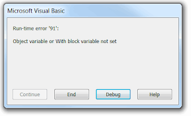

## Symptoms

SOLIDWORKS macro doesn't work if it is [run](http://help.solidworks.com/2016/english/solidworks/sldworks/t_run_macro.htm) from the Tools->Macro->Run menu in SOLIDWORKS.

This may produce error like *Run-time Error '91': Object variable or With block variable not set*.

{ width=320 height=194 }

Alternatively macro can misbehave or just do not execute any steps.
Macro runs correctly if opened in the VBA editor and executed via F5 or by clicking green arrow (run) button from the VBA editor

## Cause

When macro starts SOLIDWORKS tries to find the entry point (the subroutine (sub) to execute first). This will be the sub which doesn't contain any parameters.

If the macro contains multiple such subs this will provide the ambiguity and any sub can be an entry point.



The entry sub is critical as it usually contains initialisation routines and if this is not executed in the correct order the macro logic is compromised.

## Resolution

* Always keep one parameterless subroutine (usually called main). Use *dummy* parameter if necessarily for any other subs which do not require input parameters to prevent the incorrect behaviour. It is possible to pass any value for this parameter as it is not used (i.e. "" or Empty).

~~~ vb
Call AnotherProc(Empty) 'calling the sub with empty value
----
Sub AnotherProc(dummy) 'dummy parameter not in use
End Sub
~~~



* [Assign the macro to the button](/solidworks-api/getting-started/macros/macro-buttons). In this case it will be required to forcibly select the entry point sub so no ambiguity in case of multiple parameterless subs exist in the macro
