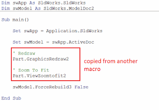

## Symptoms

SOLIDWORKS macros work correctly independently but failed to work when merged to one. Possibly, the error is displayed: *Run-time error '424': Object required*

{ width=320 height=193 }

## Cause

* Merged macros might not be compatible
* There might be required initialization from the source macro which was not copied to the destination macro
* Variable naming might be different between source and target macros  

{ width=320 height=221 }

## Resolution

* Identify which line fails
* Check the state of variables. Hover the mouse and see if it is not shown as *Nothing *in the tooltip.
* Make sure that the correct portion of the macro is copied
* Make sure that required initialization is copied as well (if applicable)
* Make sure that the variables naming is consistent
