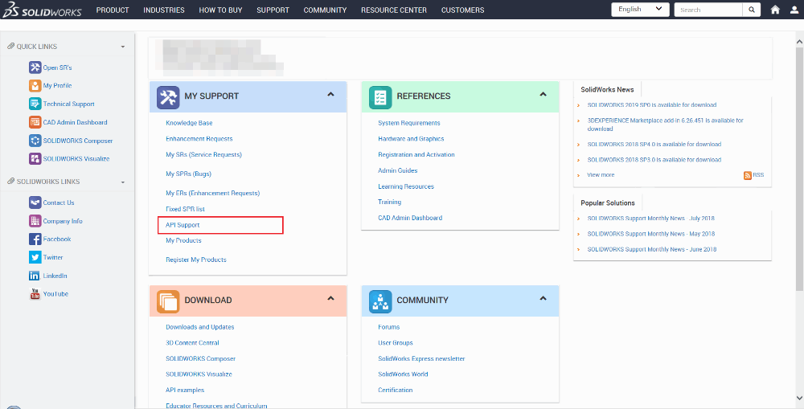
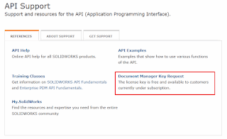

## Activating Document Manager

Document manager requires the developer license which can be requested via [SOLIDWORKS customer portal](https://customerportal.solidworks.com/)  

Follow the steps below:

* Login to customer portal
* Click *API Support* link under *My Support* section

{ width=400 height=207 }

* Select *Document Manager Key Request* link

{ width=400 height=243 }

* Select the option either to resend existing key or generate new one

{ width=320 height=95 }

* Fill the request form and select the functionality required for your software (refer [Supported Functionality]({{ 'solidworks-document-manager-api/#supported-functionality' | relative_url }}) section to select the right functions)

{ width=320 height=246 }

It usually takes several business days for key to be generated. Once generated it will be sent via e-mail.
The key is generated in the following format:

> **CompanyName**:swdocmgr_general-00000-{31 times},swdocmgr_previews-00000-{31 times},swdocmgr_dimxpert-00000-{31 times},swdocmgr_geometry-00000-{31 times},swdocmgr_xml-00000-{31 times},swdocmgr_tessellation-00000-{31 times}  

Exception below will be thrown if API is called which doesn't belong to a group for which licenses were generated.  

> Class is not licensed for use (Exception from HRESULT: 0x80040112)

## Registering Document Manager

Document Manager is automatically registered with the following applications
  * SOLIDWORKS
  * eDrawings
  * SOLIDWORKS Files Explorer
  * SOLIDWORKS PDM
  * SOLIDWORKS Document Manager SDK

To manually register the Document Manager run [regsvr32](https://en.wikipedia.org/wiki/Regsvr32) utility and pass the path to *swdocumentmanager.dll* (usually installed to *C:\Program Files\Common Files\SOLIDWORKS Shared\swdocumentmgr.dll* with Document Manager SDK).

Run Windows Command line with administrative right with the following command

> regsvr32 "C:\Program Files\Common Files\SOLIDWORKS Shared\swdocumentmgr.dll"

## Notes
 
* Document Manager key *must not* be shared outside of the organization
* Software developed using Document Manager key can only be redistributed in the binary format
	* That means that the customers of your software do not need to get the license key from SOLIDWORKS
    * That also means that this key cannot be used in VBA macros outside of the organization, but can be used in VSTA macros (if source code is not redistributed)
	* Document Manager is backward compatible until the SOLIDWORKS 2015 but it is not forward compatible.
	For example it is possible to read/write legacy data with newer version of Document Manager key for SOLIDWORKS 2015 onwards.
	* Document Manager key generated before SOLIDWORKS 2015 is both backward and forward compatible with older versions of SOLIDWORKS
	* Document Manager license key should be updated with every new release of SOLIDWORKS to support newer versions
* **Important for .NET developers:** the *swDocumentManager.dll* is not the same as *SolidWorks.Interop.SwDocumentMgr.dll* which is added as the reference to the project.
	The later one doesn't contain any implementation - this is just an interop to access COM objects implemented in *swDocumentManager.dll*

## Code Examples

### VBA

Add the reference to swdocumentmgr.dll. The dll can be usually found at C:\Program Files\Common Files\SOLIDWORKS Shared. Document manager license key might be too long so VBA editor will not be able to compile the macro. Refer the [Too Long VBA Macro Line](/solidworks-api/troubleshooting/macros/too-long-vba-macro-line/) troubleshooting article for the solution of this issue.



### C#

Add the reference to SolidWorks.Interop.swdocumentmgr.dll. The dll can be usually found at C:\Program Files\Common Files\SOLIDWORKS Shared.
Uncheck the Embed Interop Types option in the reference properties.



### VB.NET

Add the reference to SolidWorks.Interop.swdocumentmgr.dll. The dll can be usually found at C:\Program Files\Common Files\SOLIDWORKS Shared.
Uncheck the Embed Interop Types option in the reference properties.



### C++

Add the path to swdocumentmgr.dll (usually C:\Program Files\Common Files\SOLIDWORKS Shared) into the Project Properties->C/C++->General->Additional Include Directories



## References

* Online [Document Manager API Help Documentation](http://help.solidworks.com/2017/English/api/SWHelp_List.html?id=69d4ac3ff991425e980510fe49f75719#Pg0&ProductType=&ProductName=)
* [SOLIDWORKS Document Manager API Toolkit](http://www.solidapi.com/2016/01/solidworks-document-manager-api-toolkit_26.html) by Michael Spens