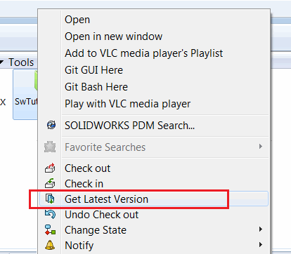

This example demonstrates how to get local copies of the file and all the dependencies to be used in desktop application. This macro is an equivalent of the following command:

{ width=350 }

PDM is a server based application and files are cached locally when they are accessed in PDM via Windows File Explorer. Files cache can be cleared or outdated. That means that desktop applications may fail when trying to access the file in PDM vault if it has not been cached locally. File Not Found error will occur (e.g. when using SOLIDWORKS API to open the file or using File System Object to traverse the folders structure or read any attributes).

To increase the performance this macro utilizes the [IEdmBatchGet](http://help.solidworks.com/2018/english/api/epdmapi/epdm.interop.epdm~epdm.interop.epdm.iedmbatchget.html) SOLIDWORKS PDM API interface which enables batch files processing.

To test this scenario

* Get the path to any SOLIDWORKS file in the vault
* Clear the cache of the vault: 

{ width=450 }

* Comment out the *GetLocalCopyFromVault* call in the *main* procedure of the following macro
* Run the macro. Notice that pointer to *swModel* is null and file open call failed
* Uncomment the *GetLocalCopyFromVault* and run macro again. Now the model is successfully opened as the file has been cached locally.


