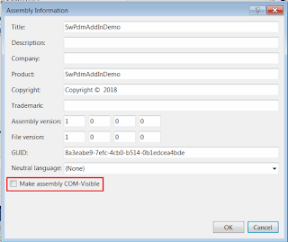
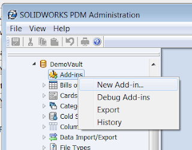
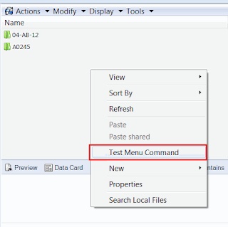
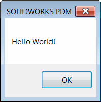
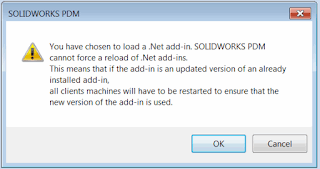

SOLIDWORKS PDM Professional (formerly SOLIDWORKS Enterprise PDM) exposes rich API libraries which enable 3rd parties to develop custom extensions for the system. The maximum level of integration can be achieved by developing the application as SOLIDWORKS PDM add-in. The detailed step-by-step instruction below will guide you through the process of creation an add-in from scratch.  

In this article I will be creating the add-in in .NET (C# and VB.NET) in Microsoft Visual Studio.  

1. Start Visual Studio and create new project
1. Select Class Library from the projects templates
1. Specify the name of your add-in
1. It is required to add the reference to PDM Interop Library (*EdmInterface.dll* for projects targeting Framework 3.5 and 2.0 and *EPDM.Interop.epdm.dll* for projects targeting Framework 4.0 or higher). Library can be found at the SOLIDWORKS PDM installation folder (usually *C:\Program Files\SOLIDWORKS PDM\EPDM.Interop.epdm.dll* for Framework 4.0 and newer and *C:\Program Files\SOLIDWORKS PDM\EdmInterface.dll* for older versions)
1. If your project is targeting .NET Framework 4.0 onwards it is required to set the *Embed Interop Types* option to *False* otherwise the add-in may misbehave.

{ width=320 height=291 }

It is required to do 3 mandatory steps to make the class for PDM add-in:

1. Implement [IEdmAddIn5 ](http://help.solidworks.com/2014/english/api/epdmapi/epdm.interop.epdm~epdm.interop.epdm.iedmaddin5.html)interface.
1. Mark the class as Com Visible
1. Specify the minimum major version supported by the add-in within the [GetAddInInfo](http://help.solidworks.com/2014/english/api/epdmapi/EPDM.Interop.epdm~EPDM.Interop.epdm.IEdmAddIn5~GetAddInInfo.html) by setting the [EdmAddInInfo.mlRequiredVersionMajor](http://help.solidworks.com/2014/english/api/epdmapi/epdm.interop.epdm~epdm.interop.epdm.edmaddininfo~mlrequiredversionmajor.html) property.



## Notes

* It is recommended **not to check** the 'Make assembly COM-Visible' option rather use [ComVisible ](https://msdn.microsoft.com/en-us/library/system.runtime.interopservices.comvisibleattribute(v=vs.110).aspx)attribute for all classes which are required to be COM visible (e.g. add-in main class). Otherwise this may significantly increase the loading time of your add-in.

{ width=320 height=269 }

* Unlike registering SOLIDWORKS add-in it is **not required** to actually register the PDM add-in DLL as COM object (i.e. run RegAsm utility or check the 'Register Assembly for COM Interops' option in Project Properties).
* It is recommended to decorate the add-in's class with [Guid](https://msdn.microsoft.com/en-us/library/system.runtime.interopservices.guidattribute(v=vs.110).aspx) attribute as this will allow to better track the add-in on client machines (e.g. debug or clear the add-ins cache).

In order to load the PDM add-in into the vault please follow the steps below:

* Start *SOLIDWORKS PDM Administration* console (can be found in the Windows Start Menu)
* Navigate to the PDM vault
* Select *Add-Ins* node and select *New Add-In...* command

{ width=320 height=250 }
    
* Select all files from the *bin* directory of the project. You do not need to add temp files like (*.pdb* or *.xml*)
* Once add-in is loaded its summary is displayed

{ width=320 height=263 }

Navigate to vault view and select the *Test Menu Command* from the context menu.  

{ width=320 height=318 }

Message box is displayed:  

{ width=198 height=200 }

SOLIDWORKS PDM is a client-server architecture system which means that whenever add-in is loaded into the vault it will be distributed to all clients. When client logins to vault PDM will download add-in dlls locally to *%localappdata%\SolidWorks\SOLIDWORKS PDM\Plugins\**VaultName**\**AddIn Guid**Index* folder.

Add-in dlls will be loaded into several processes (including *explorer.exe*) on first login to PDM vault. Due to the limitation of .NET Framework, .NET libraries cannot be unloaded from the app domain. That's why PDM displayed the *'You have chosen to load a .NET add-in. SOLIDWORKS PDM cannot force a reload of .NET add-ins' when adding the add-in to the vault.

{ width=320 height=169 }

This message means that cached (previous) version of PDM add-in will be in use until the dlls are unlocked. Instead of restarting the machine it is possible to kill all processes which are locking the dlls. You can use the following command line script to release add-in with a single command:



SOLIDWORKS PDM provides handy functionality which simplifies the debugging of PDM add-in.
Please read the following article: [Debugging SOLIDWORKS PDM Add-In - Best Practices](solidworks-pdm-api/getting-started/add-ins/debugging-best-practices)  

Below is a video demonstration of creating SOLIDWORKS PDM Add-in from scratch:


