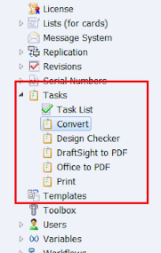
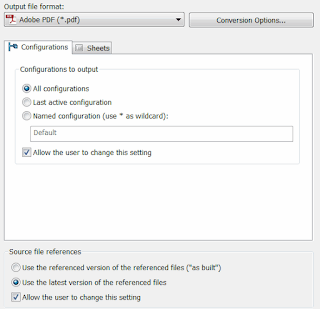
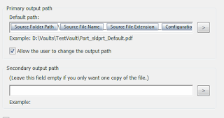
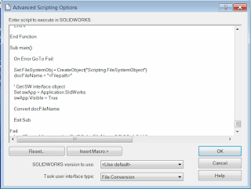
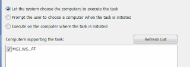

SOLIDWORKS PDM Task is a powerful built-in feature which allows to run custom functionality directly from the context menu in PDM vault or from the workflow state change trigger. The actual work can be performed either on the local machine or on the delegated remote task server.  

There are several out-of-the-box tasks provided by SOLIDWORKS PDM

{ width=203 height=320 }

Those tasks are highly customizable via task settings. For example it is possible to change the conversion settings for [Convert task](http://help.solidworks.com/2017/english/enterprisepdm/admin/t_configure_convert.htm) from the Settings Page.

{ width=320 height=308 }

As well as specify output name and folder with an ability to use placeholders (such as file name, file folder, variable value, configuration name etc.)

{ width=320 height=168 }

Tasks provide open source editable scripts which enable API developers and PDM administrators to further customize the logic of the task.

{ width=320 height=241 }

Script is utilizing SOLIDWORKS APIs and is written in Visual Basic (the same language which is used in .swp macros). The main responsibilities of the script are:

* Validate if the processing file extension is supported
* Open SOLIDWORKS file (this will work with both native or foreign file formats)
* Compose an output file name by replacing all of the placeholders
* Process the specified output options (such as quality and format)
* Traverse configurations or drawing sheets (as specified in the options)
* Log any errors
* Save the file to the specified output folder
* Close the file

As an example, in order to set the DPI settings for the PDF output is it required to add the following lines into the *SetConversionOptions* function as shown below:



{ width=640 height=210 }

Please note that starting and closing of SOLIDWORKS as well as check-in of the output file and [paste-as-reference](http://help.solidworks.com/2012/english/enterprisepdm/fileexplorer/t_Creating_a_Topic_Reference.htm) (if specified) are performed outside of the script scope.

In order to intercept the task execution for debug purposes it is required to add the *Debug.Assert False* statement anywhere in the code and make sure that the dedicated task host is set to the local machine.

{ width=320 height=113 }

The macro will then be available for debugging in the VBA editor once the task is launched. There are several limitations with this approach:

* Some of the debugging features are locked. It is only possible to debug step-by-step.
* The debug will not be working if the macro contains the compile error
In order to workaround this limitation I have developed a console utility which intercepts the debug macro and copies it to the nominated location for later troubleshooting.

When task is started SOLIDWORKS will perform the following steps:

1. Start SOLIDWORKS
1. Create new text file in temp location
1. Copy script content to the file
1. Replace all placeholders (i.e. file name, variable value, etc.)
1. Rename file to *.swb
1. Run macro
1. Delete the macro

If macro in step 5 contains compile errors then step 6 will fail and the macro won't be able to start debugging. Step 7 will be executed regardless of step 6 failed or not. So in this case it is not possible to inspect the macro for compile errors.

*CopyTaskScript* utility will intercept step 6 and copy the file to the nominated folder before deletion so it could be opened in SOLIDWORKS and troubleshooted.

I have published the utility to [GitHub](https://github.com/codestackdev/pdm-copy-task-script).

Please take a look at the video demonstration:  

  <iframe allow="autoplay; encrypted-media" allowfullscreen="" frameborder="0"
    width="560" height="315" src="https://www.youtube.com/embed/kNRbmTDAyBA">
  </iframe>

