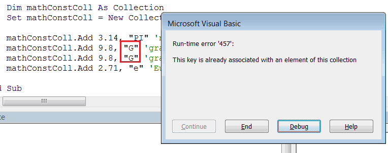

Visual Basic collection is a data sets similar to [Array](visual-basic/data-sets/array) designed to hold dynamically changing data. Unlike arrays collection doesn't need to be resized to add or remove values.

Collection is a reference type and it is required to use **new** keyword to initiate the collection

~~~ vb
Dim coll As New Collection
~~~

### Adding items

In order to add new item to the collection in Visual Basic it is required to use **Add** method of **Collection** object. This method has 4 parameters

* *item* - element to add to collection. Item can be of any type.
* *(optional)key* - String key value to associate the element with. [Reference](#indexing-items-by-keys)
* *(optional)before* - 1-based index of the element in the collection where to insert this element before [Reference](#inserting-item-at-position)
* *(optional)after* - 1-based index of the element in the collection where to insert this element after [Reference](#inserting-item-at-position)

#### Pushing item

~~~ vb
Dim coll As New Collection
coll.Add "New Value"
~~~

Calling **Add** method of **Collection** object will push the element at the end of the collection, i.e. the new element will be inserted as the last element.

#### Inserting item at position

Calling **Add** method of **Collection** object and specifying the integer values in 3rd or 4th parameter will insert the element in the specified position.

~~~ vb
Dim coll As New Collection
coll.Add "A",,<Insert Element Before This Index>
coll.Add "B",,,<Insert Element After This Index>
~~~

#### Accessing items

Similar to array, elements in the collection can be accessed by index

> Unlike default behavior of arrays collections elements are 1-based indexed, i.e. first element's index is 1.

Element can be accessed using the () symbol either directly from the variable or via **Item** method

~~~ vb
Debug.Print coll.Item(<Index Of Element>)
Debug.Print coll(<Index Of Element>)
~~~



### Indexing items by keys

Elements inserted to the collection can be associated with unique string key.

~~~ vb
Dim coll As New Collection
coll.Add "A", "key1"
coll.Add "B", "key2"
~~~

Unlike elements keys must be unique in the collection otherwise the error will be displayed

{ width=350 }

Elements in the collection can be accessed by key (similar to the way they accessed by index)

~~~ vb
Debug.Print coll.Item("<Key Name>")
~~~



### Removing items

Item can be dynamically removed from the collection using **Remove** method. It is possible to use either index or key to specify which item should be removed.

~~~ vb
coll.Remove(<Index of Element>)
coll.Remove("<Key of Element>")
~~~


