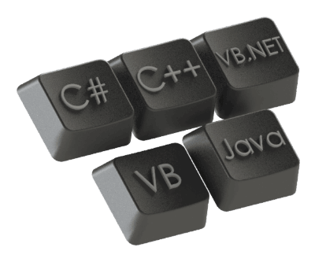

{ width=300 }

This beginners friendly tutorial is designed to introduce the main features of Visual Basic programming language.

## What is Visual Basic

Visual Basic is a Component Object Model (COM) based programming language and development environment (IDE) from Microsoft.

Although Visual Basic is now obsolete and declared legacy its derivative Visual Basic for Application (VBA), VBScript and VB.NET are still widely used in millions of applications and scripts.

The main features of Visual Basic are

* Easy learning curve
* Support of COM object which enables access to Windows API
* Support of IntelliSense (code auto complete)
* Visual drag-n-drop environment for creating Graphic User Interface (GUI)
* Ability to create executables (*.exe), ActiveX components and dlls
* Automatic memory management using reference counting which allows to avoid memory leaking

## History of Visual Basic

* 1991 - Visual Basic 1.0
* 1992 - Visual Basic 2.0
* 1993 - Visual Basic 3.0
* 1995 - Visual Basic 4.0
* 1997 - Visual Basic 5.0
* 1998 - Visual Basic 6.0
* 2008 - Declared legacy
* 2010 - VBA 7.0 (based on Visual Basic) for x64 support

## Versions of Visual Basic

[Visual Basic for Applications (VBA)](visual-basic/vba) - integrated environment for creating and executing macros used in a number of applications such as MS Office, SOLIDWORKS, AutoCAD, etc.

VBScript - language of Active Server Pages which is used for Windows scripting and client side web page scripting.

VB.NET - object-oriented successor of Visual Basic based on .NET Framework.
